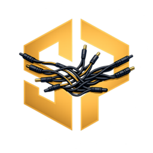

# BUSINESS_OPERATIONS_FABRIC

Customer-facing operations stack for Syndicate AI Voice Agents, centered on a tenant-safe portal served at `voice.syndicateai.co`.



## What This Repo Contains

- `syndicate-portal/`: Next.js portal app + BFF (browser talks to portal backend, not directly to VoiceOps internals)
- `TRUTH/`: canonical documentation templates and operational standards

## Current Scope (v1)

The portal currently implements:

- tenant user login/session flow
- dashboard (`/api/v1/portal/dashboard`)
- business profile view (`/api/v1/portal/business-profile`)
- agent mode read/update (`/api/v1/portal/agent-mode`)
- audit log (`/api/v1/portal/audit-log`)
- internal admin onboarding (`/internal-admin`) for tenant bootstrap + invite activation link generation
- first-login activation page (`/activate?token=...`)
- billing module scaffold (`/billing`)

Design constraints enforced:

- VoiceOps internals are not modified from this repo
- admin/bootstrap/webhook endpoints are not exposed to browser clients
- tenant-safe boundaries are enforced through a BFF allowlist

## Quick Start

```bash
cd syndicate-portal
cp .env.example .env.local
npm install
npm run dev
```

Then open: `http://localhost:3000/login`

## Build & Test

```bash
cd syndicate-portal
npm run test
npm run build
```

## Operations Docs

Portal canonical docs:

- `syndicate-portal/TRUTH.md`
- `syndicate-portal/PROJECT_STATE.md`
- `syndicate-portal/CHANGELOG.md`
- `syndicate-portal/AGENTS.md`
- `syndicate-portal/RUNBOOK.md`

Standards/templates:

- `TRUTH/README.md`
- `TRUTH/TRUTH.template.md`
- `TRUTH/PROJECT_STATE.template.md`
- `TRUTH/CHANGELOG.template.md`
- `TRUTH/AGENTS.template.md`

## Ownership

- Company: **AetherPro Technologies**
- Responsible operator: **Cory Gibson, Founder & CEO**

## License

This project is licensed under the MIT License. See `syndicate-portal/LICENSE`.
